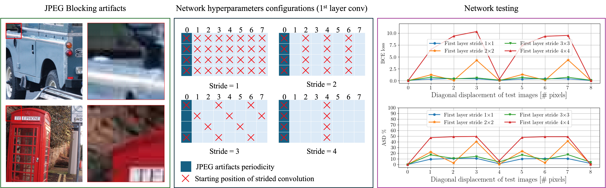

# Investigating Translation Invariance and Shiftability in CNNs for Robust Multimedia Forensics: a JPEG Case Study
<div align="center">

<!-- **Authors:** -->

**_[Edoardo Daniele Cannas](linkedin.com/in/edoardo-daniele-cannas-9a7355146/), [Sara Mandelli](https://www.linkedin.com/in/saramandelli/), [Paolo Bestagini](https://www.linkedin.com/in/paolo-bestagini-390b461b4/), [Stefano Tubaro](https://www.linkedin.com/in/stefano-tubaro-73aa9916/)_** 

</div>



This is the official code repository for the paper *Investigating Translation Invariance and Shiftability in CNNs for Robust Multimedia Forensics: a JPEG Case Study*, accepted for presentation for the [IH&MMSEC24 workshop](https://www.ihmmsec.org/cms/home) and available at this [link](https://dl.acm.org/doi/10.1145/3658664.3659644).  
The repository is currently **under development**, so feel free to open an issue if you encounter any problems.

# Getting started

In order to run our code, you need to:
1. install [conda](https://docs.conda.io/en/latest/miniconda.html)
2. create the `cnn-jpeg-tinv` environment using the *environment.yml* file
```bash
conda env create -f envinroment.yml
conda activate cnn-jpeg-tinv
```
3. download and unzip the [dataset](https://www.dropbox.com/scl/fo/px1aa2xrf5g4y3ptzejev/AAHm3nHgmwP_tymy80VPNZ4?rlkey=3jt161d0t27aqn6tepyurmftd&dl=0).

# Running the code
## Training
The [train.py](train.py) script is used to train the various models used in the paper, i.e., BondiNet, ResNet50, and DenseNet121,
in both their standard and Anti-Aliasing version.  
To replicate the same experiments as in the paper, we provided in the [`bash_scripts`](bash_scripts) folder the scripts used to train the models
with the same hyperparameter configurations.  
**Please note** that we also provide the weights of the models used in the paper at this [Dropbox link](https://www.dropbox.com/scl/fo/px1aa2xrf5g4y3ptzejev/AAHm3nHgmwP_tymy80VPNZ4?rlkey=3jt161d0t27aqn6tepyurmftd&dl=0) as well.  
## Testing
In the [notebook](notebook) folder we provide different Jupyter notebooks used to evaluate the translational invariance properties of the various networks.  
The notebook test the models displacing the test samples diagonally one pixel at a time. Since this operation can be time consuming, we also provide the pre-computed test results in the same folder.  
# Remarks
## Hardware requirements
We executed all of our experiments on a workstation equipped with Intel Xeon Gold 6246, 252 GiB of RAM, and 4 Titan RTX (4608 CUDAs @ 1350MHz, 24 GiB).  
**Please note** that for training the SOTA models in full Anti-Aliasing configuration, i.e., AA-ResNet50 and AA-DenseNet121, **at least 24 GB of VRAM** are needed from your GPU.  
As stated in the paper, this is due to the fact that full anti-aliasing requires layers to be executed with stride 1, hence elevating the memory requirements.

## Data
The dataset used in the paper is the UCID, which we provide in the repo as the original download link seems to be down.  
We also provide the JPEG images compressed with block sizes different from the standard 8x8.  
To realize your own set of images, please refer to the [compress_datasets.py](compress_datasets.py) script, while you can have a look at our 
JPEG implementation in the [jpeg_compression.py](isplutils/jpeg_compression.py) file.  
The [Data visualization.ipynb](notebook/Data%20visualization.ipynb) notebook allows to visualize the dataset and the JPEG compressed images with various blocks.  

# Citation
If you find this code useful, please consider citing our paper.  
Plain text:
```plaintext
Edoardo Daniele Cannas, Sara Mandelli, Paolo Bestagini, and Stefano Tubaro.
2024. Investigating Translation Invariance and Shiftability in CNNs for
Robust Multimedia Forensics: a JPEG Case Study. In Proceedings of the 2024
ACM Workshop on Information Hiding and Multimedia Security (IH&MMSec
’24), June 24–26, 2024, Baiona, Spain.
```
BibTeX:
```latex
@INPROCEEDINGS{Cannas2024,
  author={Cannas, Edoardo Daniele and Mandelli, Sara and Bestagini, Paolo and Tubaro, Stefano},
  booktitle={Proceedings of the 2024 ACM Workshop on Information Hiding and Multimedia Security (IH&MMSec 2024)}, 
  title={Investigating Translation Invariance and Shiftability in CNNs for Robust Multimedia Forensics: a JPEG Case Study}, 
  year={2024},
  doi={10.1145/3658664.3659644}}
```

# Credits & acknowledgements
The code has been developed at the [Image and Sound Processing Lab](https://www.deib.ispl.it/) of the [Politecnico di Milano](https://www.polimi.it/).  
We relied on the [PyTorch](https://pytorch.org/) library for the implementation of the CNNs, while we referred to the [antialiased-cnns](https://github.com/adobe/antialiased-cnns) library for the implementation of Anti-Aliasing.  
Many thanks to [Katie He](https://github.com/katieshiqihe) for the [pure python implementation](https://github.com/katieshiqihe/image_compression) of JPEG compression, really inspiring!


